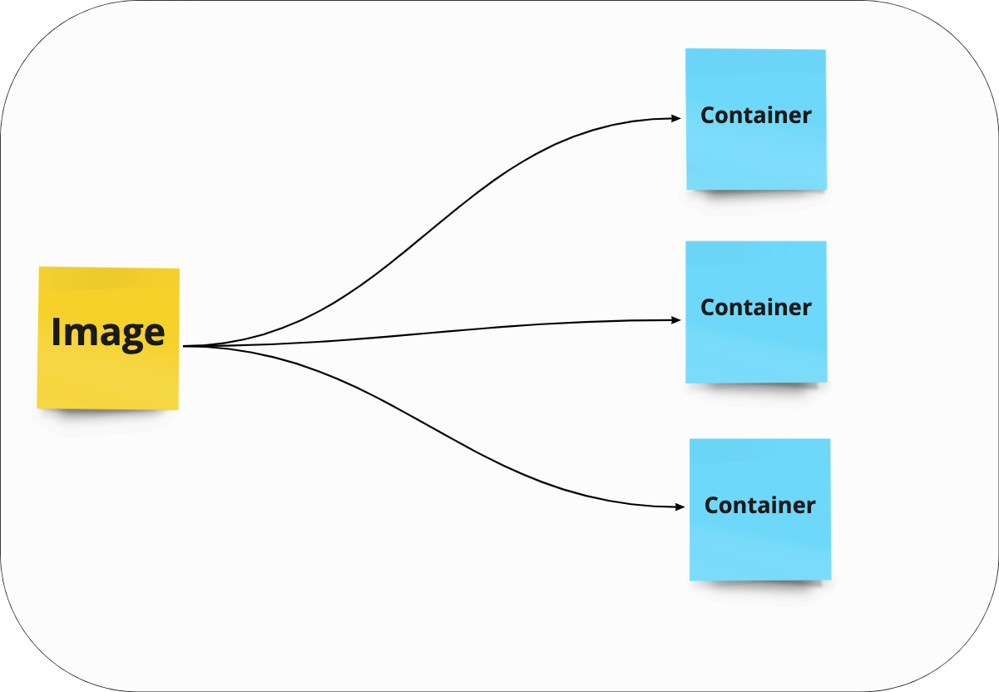

---
hide:
  - toc
---

# Images

*	Read only template that contains instructions on how to create the container.

*	The template is called a Dockerfile.

*	Usually based upon other images.

*	You can create your own images or use an image created by someone else / published in a registry
    * Registry being something like Docker hub, GCP, AWS, Azure etc

## Dockerfile Example:

```
FROM node:12.18.4-alpine # Install Alpine (version of Linux) with Node V12.18.4

WORKDIR /usr/src/app # Create directory

COPY package*.json ./ # Copy files over
COPY ./src ./src # Copy files over
RUN npm install && npm run build # Install dependencies and build
CMD npm run start # Run the app
```

---

# Containers:

*	The running instance of an image which is the result of running the image via Docker.

*	Immutable
    * Once created from an image with any configuration options, it can’t be updated

* Stateless
	  * When we delete a container, it is gone forever

* We can create, start, stop or delete a container using the Docker CLI.


---

# Images are recipes, containers are cakes



---

# What's inside a container?


```
whoami
```

```
docker run -it busybox

whoami

ls

exit
```

```
docker ps -a
```

### See that it looks like a Linux O/S